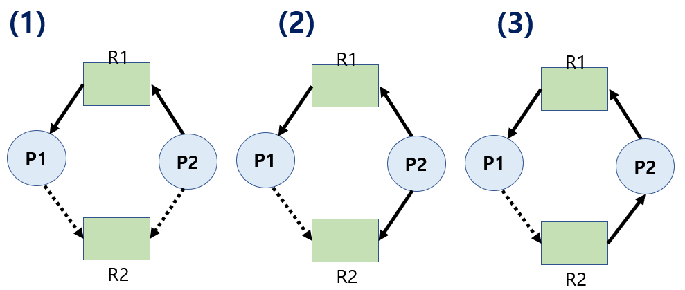
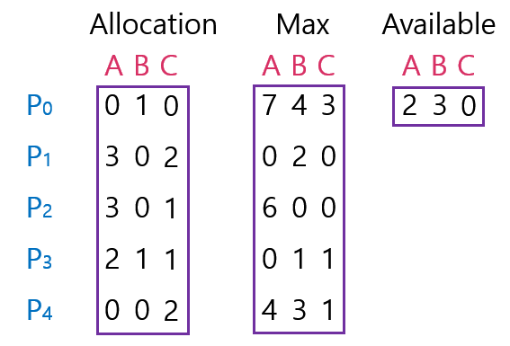

<!--more-->
# 1. DeadLock
> 일련의 프로세스들이 서로가 가진 자원을 기다리며 block된 상태.

\* Resource(자원)   
- 하드웨어, 소프트웨어 등을 포함하는 개념
- (ex. I/O device, CPU Cycle, Memory Space, Semaphore 등)
- 프로세스가 자원을 사용하는 절차
  - **Request, Allocate, Use, Release**

# 2. Deadlock 발생의 4가지 조건
- **Mutual Exclusion( 상호 배제 )**   
: 자원을 얻으면 독점적으로 사용한다. 다 쓰면 반환한다.
- **No Premmption ( 비선점 )**    
: 자원을 스스로 내어놓을 뿐 강제로 빼앗기지 않는다.
- **Hold and Wait ( 보유대기 )**    
: 자원을 가진 프로세스가 다른 자원을 기다릴때 보유 자원을 놓지 않고 기다린다.
- **Circular Wait ( 순환대기 )**    
: 자원을 기다리는 프로세스 간에 사이클이 형성되어있다.

# 3. Deadlock 발생했는지 확인 하기 위한 자원할당 그래프

\* 위 그림 설명 :   
- P : 프로세스
- R : 자원
- 사각형 안에 점 : 자원의 개수
- 화살표 : 
  - P -> R :  프로세스가 자원을 요청했지만 아직 획득하지는 못한 상태이다.
  - R -> P :  자원이 이 프로세스가 가지고 있다.

=> 그래프에 Cycle이 없으면 Deadlock이 아니다.   
=> 그래프에 Cycle이 있으면 자원의 인스턴스가 하나씩 밖에 없을때는 Deadlock이다.
그게 아니라면 Deadlock이 아니다.

1. 첫 번째 그림 : 비록 인스턴스가 2개지만 싸이클이 2개가 만들어졌으므로 Deadlock이다.
2. 두 번째 그림 : 싸이클이 존재하고 인스턴스가 모두 할당된 상태이지만 Deadlock은 아니다.    
=> 2번 프로세스와 4번 프로세스가 Deadlock 연루된 프로세스가 아니기 때문에 쓰고나서 반납을 하면 싸이클이 사라진다.

# 4. Deadlock 처리방법 4가지
1. **Deadlock Prevetion**
- 자원 할당시 Deadlock 4가지 필요 조건 중 하나가 만족되지 않도록 하는 것.
2. **Deadlock Avoidance**
- 자원 요청에 대한 부가적인 정보를 이용해서 Deadlock의 가능성이 없는 경우에만 자원을 할당.
- 시스템 State가 원래 State로 돌아올 수 있는 경우에만 자원 할당.
3. **Deadlock Detection and Recovery**
- Deadlock 발생은 허용하되 그에 대한 Detection 루틴을 두어 Deadlock 발견시 Recover
4. **Deadlock Ignorance**
- Deadlock을 시스템이 책임지지 않는다.
- 대부분의 현대 운영체제는 이를 채택 => 사람이 프로세스를 Kill : 빈번하게 발생하는 것이 아니므로 검사하는 것 자체가 오버헤드로 판단

=> 1,2번은 Deadlock 생기지 않게 미연에 방지하는 방식.   
=> 3,4번은 Deadlock 생기도록 놔둔다.    
1번이 Deadlock에 대해 가장 강한 조치에 해당.

## 1) Deadlock Prevention
> 데드락을 미연에 방지.   
데드락이 발생하는 4가지 조건 중 하나를 차단 해버림.

1. Mutual Exclusion
- 공유해서는 안되는 자원의 경우 반드시 성립해야 함.
2. Hold and Wait
- 프로세스가 자원을 요청할 때 다른 어떤 자원도 가지고 있지 않아야 한다.
- 방법1. 프로세스 시작 시 모든 필요한 자원을 할당받게 하는 방법.
- 방법2. 자원이 필요할 경우 보유 자원을 모두 놓고 다시 요청.
3. No Preemption
- Process가 어떤 자원을 기다려야 하는 경우 이미 보유한 자원이 선점됨.
- 모든 필요한 자원을 얻을 수 있을 때 그 프로세스는 다시 시작된다.
- State를 쉽게 Save하고 Restore 할 수 있는 자원에서 주로 사용(CPU, Memory)
4. Circular Wait
- 모든 자원 유형에 할당 순서를 정하여 정해진 순서대로만 자원 할당
- 예를 들어 순서가 3인 자원 Ri를 보유 중인 프로세스가 순서가 1인 자원 Rj을 할당받기 위해서는 우선 Ri를 Release해야 한다.

정리)   
\* **상호배제** : 한 번에 하나의 프로세스가 사용할 수 있는 자원이라면 배제 할 수 있는 조건이 아니다.   
\* **보유대기** : 기다리는 상황에서는 자원을 보유하지 않으면 된다. (자진해서 반납해서 문제를 해결)    
\* **비 선 점** : 자원을 뺏어올 수 있도록 하면 됨. (CPU, Memory 처럼 Save하고 Restore 가능할 경우 Preemption을 허용 한다.)   
\* **순환대기** : 자원의 순서를 정한다. ( 1번을 획득해야 5번을 획득할 수 있다 등의 획득할 순서를 정한다.)   

=> Utilization 저하, Throughput 감소, Starvation 문제 발생.

## 2) Deadlock Avoidance
> 데드락을 미연에 방지.   
프로세스가 시작되서 종료될 때 까지 사용할 자원의 최대 수를 알고 있다고 가정하고 데드락을 피해간다.

- 자원 요청에 대한 부가정보를 이용해서 자원 할당이 Deadlock으로 부터 안전(Safe)한지를 동적으로 조사해서 안전한 경우에만 할당.
- 가장 단순하고 일반적인 모델은 프로세스들이 필요로 하는 각 자원별 최대 사용량을 미리 선언하도록 하는 방법임.

\* Safe State   
: 시스템 내의 프로세스들에 대한 Safe Sequence가 존재하는 상태.

\* Safe Sequence
- 프로세스의 Sequence <P1,P2,...,Pn>이 safe하려면 Pi의 자원 요청이 **가용 자원 + 모든 Pj (j<i) 의 보유 자원**에 의해 충족 되어야 함.
  - Pi의 자원 요청이 즉시 충족될 수 없으면 모든 Pj가 종료될 때가지 기다린다.
  - Pi-1이 종료되면 Pi의 자원요청을 만족시켜 수행한다.

정리)   
- 시스템이 Safe State에 있으면 => no deadlock
- 시스템이 Unsafe State에 있으면 => deadlock 가능성 존재.
- Deadlock Avoidance는 unsafe state 들어가지 않는 것을 보장.    
=> 2가지 방법:    
**자원이 하나일 경우 - 자원 할당 그래프 사용.**   
**자원이 여러개 일 경우 - 뱅커스 알고리즘 사용.**

### ① 자원이 1개뿐일 때 데드락을 피하는 방법 : 자원할당 그래프
\* Claim Edge Pi -> Rj
  - 프로세스 Pi가 자원 Rj를 미래에 요청할 수 있음을 뜻함 ( 점선 )
  - 프로세스가 해당 자원 요청시 Request Edge로 바뀜 ( 실선 )
  - Rj가 Release되면 Assignment Edge는 다시 Claim Edge로 바꾼다.

- Request Edge의 Assignment Edge 변경시 (점선을 포함하여) Cycle이 생기지 않는 경우에만 요청 자원을 할당한다.
- Cycle 생성 여부 조사시 프로세스의 수가 n일대 O(n^2) 시간이 걸린다.

(1) 그림 : P1, P2 모두 R2를 요청할 수 있는 상태.   
(2) P2가 R2를 요청.    
(3) P2가 R2를 획득.   
=> 아직은 Deadlock은 아님.  
이 상태에서 P1이 R2를 요청하면 Deadlock이 되는 것이고 P2가 반납하고 P1이 요청하면 Deadlock이 발생하지 않는다.   

결국, Deadlock Avoidance는 최악의 상황을 가정한 것.   
Deadlock 가능성이 있는 자원의 요청에 대해서 받아 들이지 않고 그대로 놔두는 것.

### ② 자원이 여러개 일 때 데드락을 피하는 방법 : 뱅커스 알고리즘
- 가정
  - 모든 프로세스는 자원의 최대 사용량을 미리 명시
  - 프로세스가 요청 자원을 모두 할당바은 경우 유한 시간안에 이들 자원을 다시 반납한다.
- 방법
  - 기본 개념 : 자원 요청시 Safe 상태를 유지할 경우에만 할당.
  - 총 요청 자원의 수가 가용 자원의 수보다 적은 프로세스를 선택.    
  (그런 프로세스가 없으면 Unsafe 상태를 의미)
  - 그런 프로세스가 있으면 그 프로세스에게 자원을 할당.
  - 할당받은 프로세스가 종료되면 모든 자원을 반납.
  - 모든 프로세스가 종료될 때까지 이러한 과정 반복.

\* Sequence <P1,P3,P4,P2,P0>가 존재하므로 시스템은 Safe Sate    

- Allocation : 현재 프로세스별 할당된 자원 현황
- Max : 프로세스가 평생 가질 최대 자원의 수
- Available : 지금 사용가능한 자원
- Need : 추가 최대 요청 가능한 자원

Example)    
P1(2,0,0)이 추가로 (1,0,2)를 요청했을 때,    
추가 요청 가능한 자원(Need)을 가용자원(Available)이 만족하는가?   
->P1 추가 요청 가능 자원(Need)는 (1,2,2)이고 현재 가용 자원(Available)은 (3,3,2)이므로 가능하다!

->따라서 추가요청을 할당(1,0,2) 해주면 남는 가용 자원(Available)은 (2,3,0)이 되고 P1은 (3,0,2)가 된다.    
(최악의 경우를 가정하는 알고리즘이기 때문에 추가 최대 요청 가능한 자원을 만족해야만 할당해준다.)    

=> 가용자원만으로 최대 요청을 충족하지 못하면 Deadlock 발생할 수 있으므로 가용 자원으로 처리가 가능한 프로세스에게 할당한다.    
=> 프로세스가 종료되었을 때 반납하면 가용자원이 늘어나게 되므로 이전에 할당하지 못했던 프로세스에게도 할당이 가능하게 된다.   