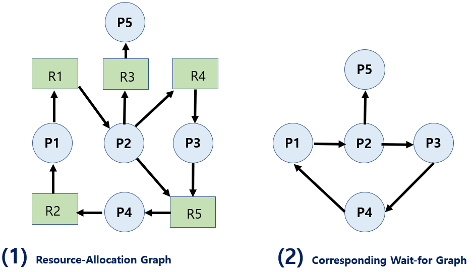
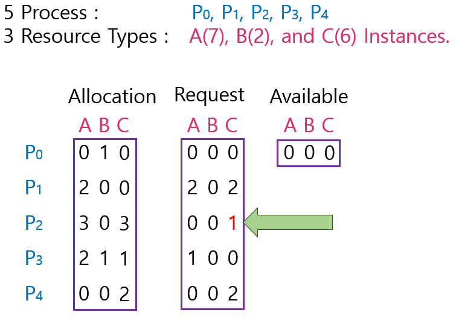

<!--more-->
## 3) Deadlock Detection and Recovery
> 데드락 생기게 둔다.   
시스템이 느려지거나 문제가 있는 거 같다면 데드락이 있는지 검사하고 회복시킨다.

1. Deadlock Detection
- Resource Type Single Instance인 경우
  - 자원 할당 그래프에서의 Cycle이 곧 Deadlock을 의미
- Resource Type Multiple Instance인 경우
  - Banker's Algorithm과 유사한 방법 활용
2. Wait-for Graph 알고리즘
- Resource Type Single Instance인 경우
- Wait-for Graph
  - 자원할당 그래프의 변형
  - 프로세스만으로 node 구성
  - Pj가 가지고 있는 자원을 Pk가 기다리는 경우 Pk -> Pj
- Algorithm
  - Wait-for Graph에 사이클이 존재하는지를 주기적으로 조사
  - O(n^2)

=> 프로세스 N개 있을때 싸이클이 있는 지 확인하려면 화살표를 다따라가보면 된다.
점이 N개일 때 화살표 Maximum은 각각의 점에서 N-1개로 화살표가 나가니까 N*N-1 이므로 O(n^2)이 된다.

### 3-1) Dectection
① 자원당 인스턴스가 하나뿐일때 데드락을 검사하는 방법 : 자원할당 그래프   

\* 자원의 최대 사용량을 미리 알릴필요 없기 때문에 점선 없음.

② 자원당 인스턴스가 여러개일때 데드락을 검사하는 방법 : Table이용   
- Allocation : 프로세스별 현재 자원 할당 정보
- Request : 프로세스별 추가 요청 자원
- Available : 가용자원 

데드락인지 판별하기 위해서는 낙관적으로 판별한다.    
P0 추가요청 자원이 없으므로 반납할 것이라고 생각하고 진행.. P2도 마찬가지     
=> 현재 추가로 자원을 요청한 것이 없는 프로세스로부터 할당된 자원을 반납한다고 가정하고 진행한다.

=> 이 경우엔 추가 요청 안한 프로세스가 P0이므로 B 하나를 반납하더라도 
나머지 프로세스의 자원을 추가로 할당해줄 수 없게 되므로 DeadLock이 된다.   
==> 순서)    
1. 가용자원으로 처리 가능한가?
2. 지금 요청하지 않은 프로세스를 반납한다.
3. 1~2번 반복한다.

### 3-2) Recovery
> Deadlock 발견되면 Recovery
1. Deadlock에 연루된 프로세스를 전부 죽인다.    
(프로세스를 종료시키는 방법)    
2. Deadlock에 연루된 프로세스를 하나 죽여보고 Deadlock 판별     
=> 다시 하나 죽여보고 판별 반복한다.    
(Deadlock에 연루된 프로세스로부터 자원을 뺏는 방법)   

\* 2번 문제점?    
뺏었더니 뺏은 프로세스가 다시 할당받고 뺏고 할당받고 될 수 있으므로 주의 해야함.    
( ex. 자원을 뺏는 패턴 변경)    
Starvation도 주의   
( 그 프로세스만 계속해서 뺏으면 안됌 : 비용을 최소화하는 것만 고려 하지 않는다. )

## 4) Deadlock Ignorance
> 데드락 생기게 둔다.    
데드락이 생기면 프로세스 정지, 느려지면 사용자가 알아서 처리

\* Deadlock이 일어나지 않는다고 생각하고 아무런 조치도 하지 않음.
  - Deadlock이 매우 드물게 발생하므로 Deadlock에 대한 조치 자체가 더 큰 오버헤드일 수 있다.
  - 만약, 시스템에 Deadlock이 발생한 경우 시스템이 비정상적으로 작동하는 것을 사람이 느낀 후 직접 Process를 죽이는 방법등으로 대처해야함.
  - 현대 대부분의 OS가 이를 채택.