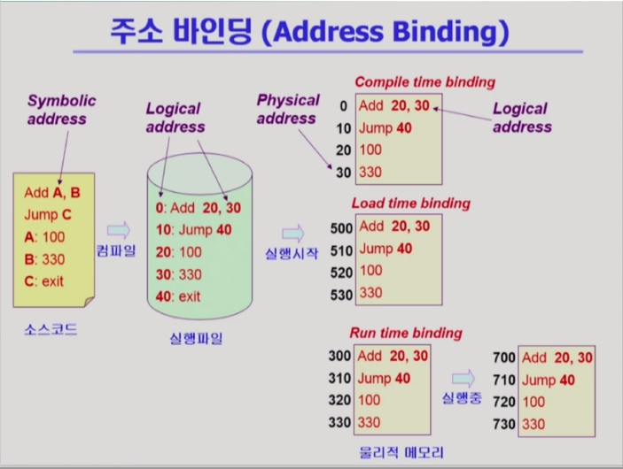
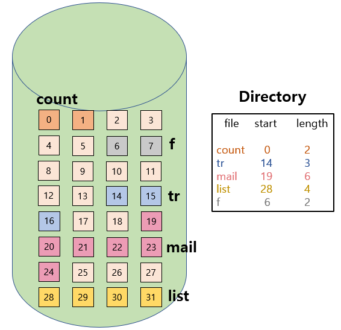
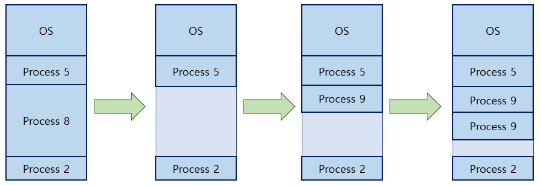

<!--more-->

# 1. Logical Address vs Physical Address
1. **Logical Address (=Virtual Address)**
  - 프로세스마다 독립적으로 가지는 주소 공간
  - 각 프로세스마다 0번지부터 시작
  - CPU가 보는 주소는 Logical Addrss이다.
2. **Physical Address**
  - 메모리에 실제 올라가는 위치

\* **주소 바인딩 : 주소를 결정하는 것**   
**Symbolic Address -> Logical Address -> Physical Address**   

\* **Symbolic Address** : 프로그래머는 숫자로 된 주소를 사용하지 않는다.    
(변수 이름 이라던지 함수 이름이라던지..)
=> 컴파일 되면 숫자인 **Logical Address**   
=> 실행되려면 물리적 메모리에 올라가야하므로 주소변환이 이루어져야한다.   
(주소결정 = **Address Binding**)    
=> **Physical Address**

\* 각 프로그램마다 가지고 있는 논리적 주소가 물리적 주소로 언제 결정되는가?   
=> 총 3가지 시점으로 나눌 수 있다.

# 2. 주소 바인딩 (Address Binding)
1. **Compile Time Binding** : 컴파일 시
  - 물리적 메모리 주소(Physical Address)가 컴파일 시 알려짐
  - 시작 위치 변경시 재컴파일
  - 컴파일러는 절대코드(Absolute Code) 생성   
  ( = 컴파일시 주소가 Fixed 된다.)
2. **Load Time Binding** : 실행이 시작될 시
  - Loader의 책임하에 물리적 메모리 주소 부여
  - 컴파일러가 재배치가능코드(Relocatable Code)를 생성한 경우 가능    
  ( = 정해져 있는 것이 아니라 실행시 비어있는 곳 어디든 올라간다.)
3. **Execution Time Binding (=Run Time Binding)** : 실행도중
  - 수행이 시작된 이후에도 프로세스의 메모리 상 위치를 옮길 수 있음.
  - CPU가 주소를 참조할 때마다 Binding을 점검 (=Address Mapping Table)
  - **하드웨어적인 지원이 필요 (ex. MMU)**

## Example

**① Compile Time Binding** : 컴파일때 물리적 주소가 이미 결정되므로 ***Logical Address가 곧 Physical Address***가 됨.   
주소가 많이 비어있어도 그 자리에 꼭 올려야하므로 비효율적이다.   
=> 현대 컴퓨터에서는 사용하지 않음.   

**② Load Time Binding** : 논리적 메모리까지 결정된 상태에서 실행시키면 물리적 메모리 주소가 결정됨.   
( ex. 물리적 메모리 살펴보니 500번지부터 비어있더라 -> 500번지부터 올리자)    

_=> 1,2번은 프로그램 시작시 한 번 결정 후 바뀌지 않음._   

**③ Execution Time Binding(Run Time Binding)** : 프로그램 실행 도중 물리적 메모리 주소 이동이 가능.   
( ex. 300번지에 있다가 메모리에서 쫓겨났다가 다시 올라왔는데 빈 곳이 700번지 -> 이번엔 700번지로 올리자)    
-> 프로그램 실행 중에도 주소가 바뀌므로 CPU가 메모리 주소를 요청할 때 마다 Binding을 체크해야함.    
=> ***하드웨어적 지원이 필요하다. (MMU : 그때그때 주소변환을 해줌.)***    

\* CPU가 바라보는 주소는?   
=> **Physical Address가 아니라 Logical Address를 바라본다.**    
코드 내에 들어 있는 주소까지 변환이 되지 않기 때문..    
(Logical Address에서 Add 20 30 : 20번지 30번지 더하라!     
=> Pysical Address 내에서도 20번지 30번지 더하라라고 되어있음.)      
=> 따라서 CPU도 논리적 메모리 주소를 볼 수 밖에 없다.   
=> CPU가 매번 메모리 몇 번지에 있는 내용을 달라 요청하면     
그때 주소 변환해서 물리적 메모리 위치를 찾아서 읽어서 CPU한테 전달해줘야함.

# 3. Memory Management Unit (MMU)
> **Logical Address를 Physical Address로 매핑해주는 Hardware Device**

\* MMU Scheme   
: 사용자 프로세스가 CPU에서 수행되며 생성해내는 모든 주소 값에 대해 Base Register (=Relocation Register)의 값을 더한다.   

\* User Program   
- Logical Address만을 다룬다.
- 실제 Physical Address를 볼 수 없으며 알 필요가 없다.

## Dynamic Relocation

=> 프로세스 P1 실행 중... 
( 논리주소 0~3000번지 / 물리주소엔 14000번지에 올라가 있는 상황 )    
CPU가 346번지 내용 달라 -> 논리 주소이므로 물리 주소로 변환이 필요하다.   
주소 변환을 해주는 것은 **MMU :  가장 간단한 방법은 레지스터 2개로 주소변환 하는 것**   
=> 물리적 주소에 올라가 있는 **시작 위치 + 요청한 논리 주소 값**    

### ① Relocation Register (=Base Register) : 프로그램이 올라간 물리적 주소 시작 위치를 저장해둔다.
### ② Limit Register : 프로그램의 주소 크기를 저장해둔다. ( 다른 메모리 주소를 요청하지 못하게 제한 )

\* 운영체제 및 사용자 프로세스 간의 메모리 보호를 위해 사용하는 레지스터
  - Relocation Register : 접근할 수 있는 물리적 메모리 주소의 최소값
  - Limit Register : 논리적 주소의 범위

=>논리 주소가 프로그램 크기보다 더 큰 메모리 주소를 요청했는 지 판단.   
크다 : 트랩 발생! => 운영체제에 CPU 권한이 넘어가고 에러를 발생.   
작다 : Base Register의 값을 더해서 메모리 주소를 구한 후 CPU에 전달해준다.   

# 4. Some Terminologies
1. **Dynamic Loading**
2. **Dynamic Linking**
3. **Overlays**
4. **Swapping**

## 1) Dynamic Loading
> 프로그램을 메모리에 동적으로 올린다.    
=> 그때그때 필요할때 마다 메모리에 올린다.    
\* Loading : 메모리에 올리는 것을 의미.

- 프로세스 전체를 메모리에 미리 다 올리는 것이 아니라 해당 루틴이 불려질 때 메모리에 load
- Memory Utilization의 향상
- 가끔씩 사용되는 많은 양의 코드의 경우 유용
- 운영체제의 특별한 지원 없이 프로그램 자체에서 구현 가능   
( 운영체제가 라이브러리를 제공해주며 그걸 이용하여 구현) 

\* 현재 컴퓨터 시스템 - 필요한 부분만 메모리에 올라가고 필요 없는 부분은 다시 내림    
=> Dynamic Loading이 아니라 OS가 관리해주는 Paging System에 해당.   
(현대는 구분하지 않고 사용할 때도 있음)   

## 2) Dynamic Linking
> 프로그램 작성 후 컴파일하고 링크에서 실행파일을 만듬.   
\* Linking : 여려 곳에 존재하는 컴파일된 파일들을 하나로 묶어서 실행파일로 만드는 것을 의미

\* Linking을 실행 시간까지 미루는 기법
1. **Static Linking**
  - 라이브러리가 프로그램의 실행 파일 코드에 포함됨
  - 실행 파일의 크기가 커짐
  - 동일한 라이브러리를 각각의 프로세스가 메모리에 오리므로 메모리 낭비
2. **Dynamic Linking**
  - 라이브러리가 실행시 연결됨
  - 라이브러리 호출 부분에 라이브러리 루틴의 위치를 찾기 위한 stub이라는 작은 코드를 둠
  - 라이브러리가 이미 메모리에 있으면 그 루틴의 주소로 가고, 없으면 디스크에서 읽어옴
  - 운영체제의 도움이 필요

\* Dynamic Linking을 해주는 라이브러리를 Shared Library라고 부른다.   
리눅스에서는 Shared Object,   
**윈도우에서는 DLL (Dynamic Linking Library)**    

## 3) Overlays
> 메모리에 필요한 부분만 그때그때 올려놓는 것.

- 메모리에 프로세스의 부분 중 실제 필요한 정보만을 올림
- 프로세스의 크기가 메모리보다 클 때 유용
- 운영체제의 지원없이 사용자에 의해 구현
- 작은 공간의 메모리를 사용하던 초창기 시스템에서 수작업으로 프로그래머가 구현
  - Manual Overlay
  - 프로그래밍이 매우 복잡

**Dynamic Loading과 차이?**   
과거 메모리 크기가 작아서 프로그램 하나를 메모리에 올려놓는 것 마저도 불가능했음.   
=> 프로그래머가 큰 프로그램을 쪼개서 올리고 내리고를 수작업으로 코딩했음 이를 Overlay라고 부름.    
=> Overlays는 운영체제의 라이브러리 제공 x

## 4) Swapping
> 프로세스를 메모리에서 통째로 쫓아내는 것    
(하드디스크 = Backing Store = Swap Area)

\* **Swap In / Swap Out**   
- 일반적으로 중기 스케줄러에 의해 Swap Out 시킬 프로세스 선정
- Priority-Based CPU Scheduling Algorithm
  - Priority가 낮은 프로세스를 Swapped Out 시킴
  - Priority가 높은 프로세스를 메모리에 올려놓음
- Compile Time 혹은 Load Time Binding에서는 원래 메모리 위치로 Swap In 해야함.
- Swap Time은 대부분 Transfer Time (Swap 되는 양에 비례)

\* **Swap Time?**
보통 디스크를 접근하는 시간은 **Seek Time(디스크 헤더가 이동하는 시간)**이 대부분을 차지하고 **Transfer Time(데이터 전송 시간)**은 미미하다.   
그런데, 용량이 방대한 ***Swapping에서는 파일입출력과는 다르게 디스크 접근 시간 대부분이 Swap 되는 데이터 양에 비례하는 Transfer Time이 차지한다.***

1. **Swap Out : Main Memory-> Swap Area**
2. **Swap In : Swap Area -> Main Memory**

# 5. 물리 메모리의 할당
> 메모리는 일반적으로 두 영역으로 나누어 사용한다.
**OS 상주영역** : Interrupt Vector와 함께 낮은 주소 영역 사용
**사용자 프로세스 영역** : 높은 주소 영역 사용

\* 사용자 프로세스 영역의 할당 방법?    
1. **Contiguous Allocation( 연속 할당 )**   
: 각각의 프로세스가 메모리의 **연속적인 공간에 적재**도록 하는 것
  - ***Fixed Partition Allocatoin ( 고정 분할 )***
  - ***Variable Partition Allocation (가변 분할 )***
2. **NonContiguous Allocation( 불연속 할당 )**    
: 하나의 프로세스가 메모리의 **여러 영역에 분산**되어 올라가도록 하는 것
  - **Paging**
  - **Segmentation**
  - **Paged Segmentation**

## 1) 연속 할당
## **① 고정 분할 방식** : 프로그램이 들어갈 사용자 영역을 미리 파티션으로 나누어 두는 것.
- **물리적 메모리를 몇 개의 영구적으 분할로 나**눔
- 분할의 크기가 모두 동일한 방시과 서로 다른 방식이 존재
- 분할당 하나의 프로그램 적재
- 융통성이 없음
  - 동시에 메모리에 load되는 프로그램의 수가 고정됨.
  - 최대 수행 가능 프로그램 크기 제한
- **내부 단편화 발생 (외부 단편화도 발생)**
## **② 가변 분할 방식** : 미리 나눠두지 않는 것.
- **프로그램의 크기를 고려해서 할당**
- 분할의 크기, 개수가 동적으로 변함
- 기술적 관리 기법 필요
- **외부 단편화 발생**

\* **외부 조각** : 올릴려는 프로그램보다 메모리 조각이 작을 경우    
(프로그램이 들어갈 수 있음에도 작아서 사용하지 못함)    
\* **내부 조각** : 프로그램 크기가 공간보다 작아서 남는 공간이 있을 경우    
(할당되었지만 사용되지 않는 영역)   

문제점) 미리 나눠둠으로써 이런 문제가 생긴 것. 나눌 필요가 있는가?   
=> 프로그램이 실행될때마다 차곡차곡 메모리에 올리는 방식 ( 가변 분할 방식 )   
=> 가변 분할 방식으로 하더라도 프로그램 크기가 균일하지 않기 때문에 외부조각은 생길 수 있다.    

**Hole**
- 가용 메모리 공간
- 다양한 크기의 Hole들이 메모리 여러 곳에 흩어져 있음
- 프로세스가 도착하면 수용가능한 Hole을 할당
- 운영체제는 다음의 정보를 유지
  1. 할당 공간
  2. 가용 공간

    

=> 가변분할 방식을 쓰다 보면 프로그램이 종료 될때마다 작은 Hole들이 산발적으로 생기게 된다.

가용공간 어디에 프로그램을 할당할 것인가?   
=> 가변 분할 방식에서 가용공간에서 할당하는 방식    
=> 3가지 방식이 있다.

1. **First-Fit**
  - Size가 n 이상인 것 중 **최초로 찾아지는 Hole에 할당**
2. **Best-Fit**
  - Size가 n 이상인 가장 작은 Hole을 찾아서 할당( **가장 적합한 Hole에 할당** )
  - Hole들의 리스트가 크기순으로 정렬되지 않은 경우 모든 Hole의 리스트를 탐색해야함
  - 많은 수의 아주 작은 Hole들이 생성됨
3. **Worst-Fit**
  - **가장 큰 Hole에 할당**
  - 역시 모든 리스트를 탐색해야함
  - 상대적으로 아주 큰 Hole들이 생성됨

\* **Compaction**
- 외부 단편화 문제를 해결하는 한 가지 방법
- 사용 중인 메모리 영역을 한군데로 몰고 Hole들을 다른 한 곳으로 몰아 큰 Block을 만드는 것
- 매우 비용이 많이 드는 방법
- 최소한의 메모리 이동으로 Compaction하는 방법
- Compaction은 프로세스의 주소가 실행 시간에 동적으로 재배치가 가능한 경우에만 수행

=> 사용중인 공간을 한 곳으로 미뤄두고 Hole들을 모아서 하나로 묶는 것.   
( ex. 디스크 조각 모음)   
전체 프로그램의 binding에 관련된 문제이므로 비용이 많이 드는 방식이다.    
Runtime Binding이 지원되야지만 사용할 수 있다.    