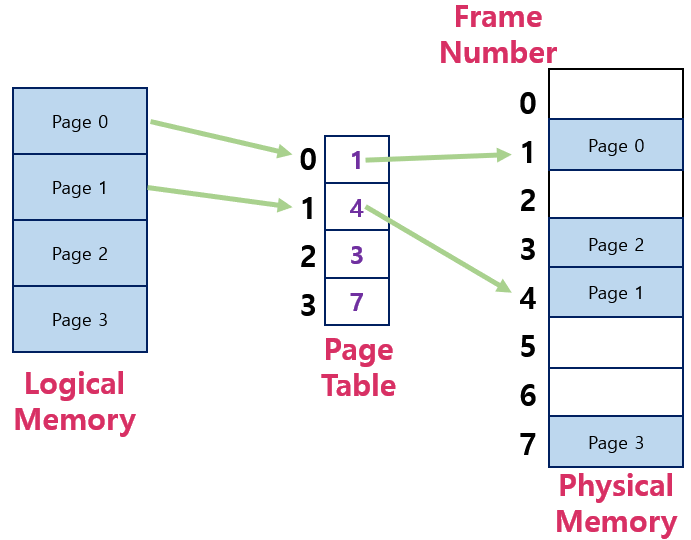
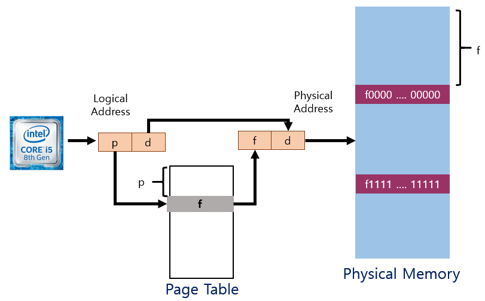
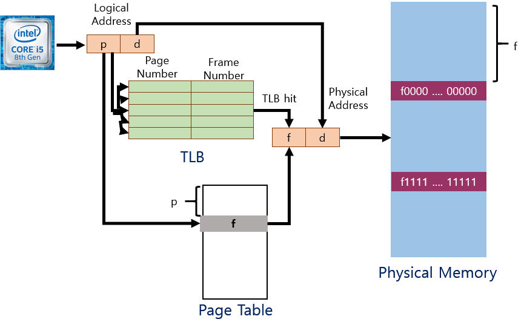
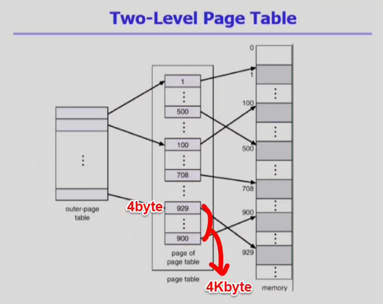
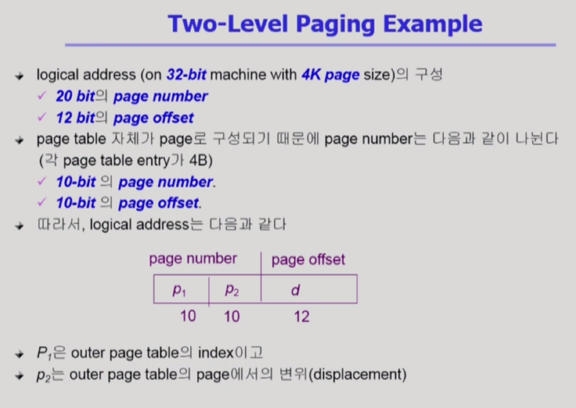
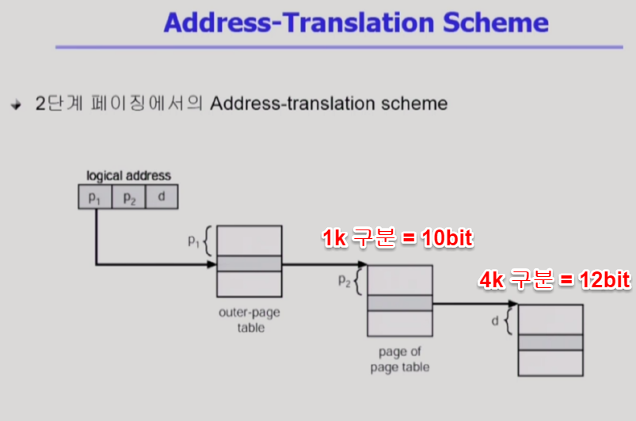

<!--more-->

## 2) 불연속 할당
1. **Paging** : 기법은 프로그램을 구성하는 주소공간을 **같은 크기의 Page로 자른다.**( 4kb)
- Page 단위로 물리 메모리에 올리거나 내린다   
**PageFrame = 페이지가 들어갈 수 있는 공간**
- Hole들의 크기가 균일하지 않은 문제    
Compaction 하는 것 등을 해결 가능
- 단점 : 주소 변환이 복잡해진다.    
잘려진 각각의 페이지가 물리메모리 어디에 올라갔는지 확인해야함.    
페이지별로 주소 계산을 해야한다.    
2. **Segmentation** : **Page 단위가 아닌 의미있는 단위로 자르는 것.**
- Code,Data,Stack으로 의미 있는 공간으로 잘라서 각각의 segment를 필요시에 물리 메모리 다른 위치에 올리는 것임.   
( 함수 단위로도 가능 )    
- 단점 : 의미 단위로 잘랐기 때문에 크기가 균일하지 않다.    
Hole 문제 발생할 수 있다.   
3. **Paged Segmentation**

## **① Paging 기법**
> 프로그램을 구성하는 Address Space을 같은 크기의 Page 단위로 쪼갠 것.

- Process의 Virtual Memory를 동일한 사이즈의 Page 단위로 나눔
- Virtual Memory의 내용이 Page 단위로 불연속하게 저장됨
- 일부는 Backing Storage에, 일부는 Physical Memory에 저장

\* Basic Method
- Physical Memory를 동일한 크기의 Frame으로 나눔
- Logical Memory를 동일 크기의 Page로 나눔(Frame과 같은 크기)
- 모든 가용 Frame들을 관리
- Page Table을 사용하여 Logical Address를 Physical Address로 변환
- 외부 단편화 발생 안함
- 내부 단편화 발생 가능

    

=> 프로그램을 구성하는 논리적 메모리를 동일한 크기의 Page로 잘라서   
각각의 Page별로 물리적 메모리 어디든 비어있는 위치에 올라갈 수 있게 해준다.   ( **Page Frame** )
=> 주소변환을 위해서는 **Page Table**이라는 것이 필요하다.    
=> ***각각의 논리적 메모리에 있는 Page들이 물리적 메모리 어디에 올라가 있는가를 알려줌***   

** Page Table은 Page 갯수만큼 엔트리가 존재한다.** 

### ①-1. Address Translation Architecture
    

CPU가 논리적 주소를 주게 되면 물리적 메모리상에 주소로 바꿔야하는데
**Paging 기법에서는 Page Table**을 사용한다.    

위 그림에서 (p, d)는    
( 페이지 번호, 페이지 내에서 얼마나 떨어져 있는 지 나타내는 offset )을 의미한다.    

논리적인 페이지 번호에 해당하는 엔트리를 페이지 테이블에서 p번째를 찾는다.    
=> f 라는 Page Frame 번호가 나옴.   
=> 물리적 메모리에서 f 번째를 찾는다. => 주소변환 끝!   
=> d는 변환되지 않고 그대로인 이유는 내부에서 상대적 위치는 논리나 물리나 같기 때문   

### ①-2. Implementation of Page Table
- Page Table은 Main Memory에 상주
- **Page-Table Base Register(PTBR)가 Page Table을 가리킴**
- **Page-Table Length Register(PTLR)가 테이블 크기를 보괸**
- 모든 메모리 접근 연산에는 2번의 Memory Access 필요
- Page Table 접근 1번, Data/Instruction 접근 1번
- 속도 향상을 위해 **Associative Register 혹은 Translation Look-aside Buffer(TLB) 라 불리는 고속의 Lookup Hardware Cache 사용**   

\* 동적할당에서 MMU에 Base Register, Limit Register가 존재했음    
=> Paging 기법에서는 Page-Table Base Register, Page-Table Length Register라는 용도로 사옹됨.    

**Page Table은 프로그램마다 별도로 존재**해야하고 용량이 크기 때문에
레지스터, 캐시메모리에 넣기 어려움 => 메모리에 집어 넣는다.   
=> 주소변환을 위해 1번 접근   
=> 변환된 주소로 접근 1번   
=> 총 2번의 접근이 필요하다.    

2번의 접근은 시간 소모가 많이 되므로 속도 향상을 위해 **일종의 캐시인 TLB를 사용한다.**   
=> Main memory 와 CPU 사이에 존재.    

### ①-3. Paging Hardware with TLB
    

2번의 메모리 접근의 속도 개선을 위해 TLB라는 캐시 메모리를 둔다.    
Main-Memory에서 빈번히 사용되는 데이터를 캐시 메모리에 저장해서 CPU로부터 빠르게 접근하게 해줌.   
주소변환을 위한 캐시메모리임.   
***TLB는 페이지테이블에서 빈번히 참조되는 일부 엔트리를 캐싱하고 있다.***   

TLB는 전체를 검색해야하므로 시간을 단축하기 위해 **Parallel Search가 필요하다.**    
Page Table은 p번호 = p인덱스이므로 주소변환이 바로 이루어지므로 Parallel Search가 필요하지 않다.    
Page Table이 프로세스마다 별도로 존재해야하므로 TLB도 마찬가지다.   

### ①-4. Effective Access Time
￡ : TLB를 접근하는 시간 ( 1보다 작다)   
1 : Main memory 접근시간    
∂ : TLB로부터 주소변환이 되는 비율 (= Hit ratio)    

=> 실제로 메모리에 접근하는 시간 :   
(1+￡)∂ + (2+￡)(1-∂)   

### ①-5. 2단계 페이지 테이블
- 현대의 컴퓨터는 Address Space가 매우 큰 프로그램 지원
- 32 bit Address 사용시 : 2^32(4G)의 주소 공간
  - Page Size가 4K시 1M개의 Page Table Entry가 필요
  - 각 Page Entry 4B시 프로세스당 4M의 Page Table 필요
  - 그러나, 대부분의 프로그램은 4G의 주소 공간 중 지극히 일부분만 사용하므로 Page Table 공간이 심하게 낭비됨

=> Page Table 자체를 Page로 구성    
=> 사용되지 않는 주소 공간에 대한 Outer Page Table의 엔트리 값은 NULL   

정리)   
논리적인 메모리의 크기가 Maximum 어디까지 가능한가?   
=> 메모리를 크기를 표시하는 주소체계를 몇 비트쓰느냐에 달림.    
=> 주소는 바이트 단위로 구성된다.   
=> 32비트로 구성되면 0 ~ 2^32   -1 까지 가능 (4기가)    
=> 4기가를 Page 단위로 쪼갠다 (Page 크기는 4kb) => 총 1M개의 Page 개수가 얻어진다.    
=> Page Table 엔트리 1M(100만개)가 필요. (엔트리 하나는 4byte)    
=> 프로그램마다 Page Table을 위해 4M을 사용해야한다.    

cf) 기존의 PageTable의 문제점 : 메모리 주소공간에서 실제 프로그램이 사용하는 공간은 지극히 일부분임    
Code, Data, Stack있고 중간에는 사용되지 않는 부분이 상당부분 존재   
페이지 테이블의 엔트리는 중간에 구멍있다고 빼고 만들 수 없다.   
따라서 주소체계에서 상당히 일부분만 사용됨에도 페이지 테이블 엔트리는 다 만들어져야함)    

=> 이를 해결하기 위해 2단계 페이지 테이블 방식을 사용.    
(시간 더 걸리지만 공간을 줄일 수 있다. => 공간도 더쓰는 것 같은가?    
=> cf에 나와있듯이 사용하지 않는 공간이 많음.     
=> 이를 2단계에서는 바깥쪽 테이블 엔트리 NULL로 설정(포인터로)    
=> 안쪽 테이블이 만들어지지 않음)   
    
=> 안쪽 페이지 테이블의 하나의 크기는 페이지의 크기와 똑같다 = 4kb    
엔트리 크기는 4byte => 1k개 집어 넣을 수 있다.

 
(4kb = 2^12바이트)    
page offset = 페이지 크기 4kb를 byte단위로 구분하기 위해서는 12비트가 필요하다.   
(1k = 2^10)   
안쪽 페이지 테이블의 엔트리 = 1k의 엔트리를 구분하기 위해서는 10비트가 필요하다.    
32 - 22이므로 밖을 위한 페이지 테이블 = 10비트가 필요하다.    

    
바깥 쪽 페이지 테이블의 인덱스 => 안쪽 페이지 테이블의 어떤 것인지 결정    
안쪽 페이지 테이블의 인덱스 => 물리적 페이지 프레임 번호    