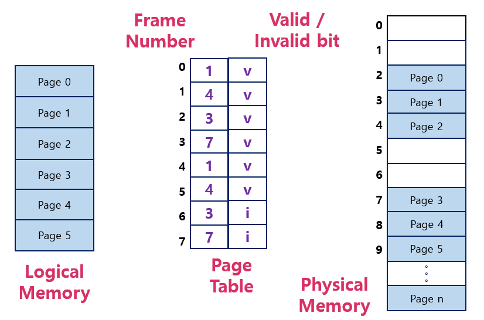
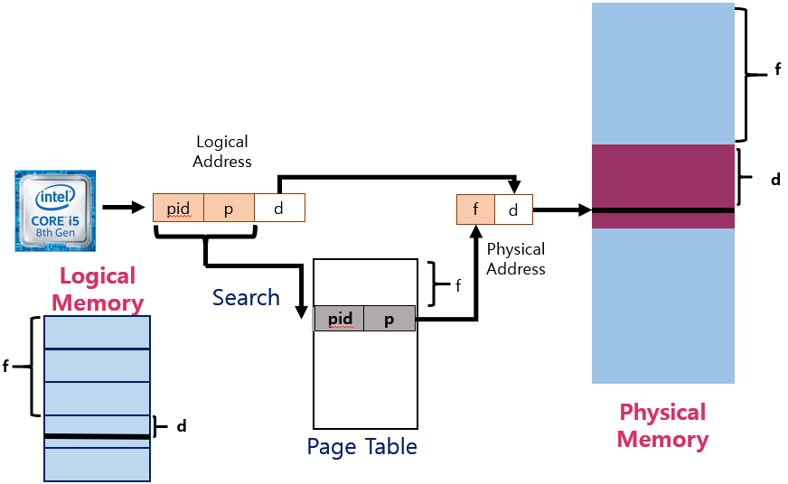
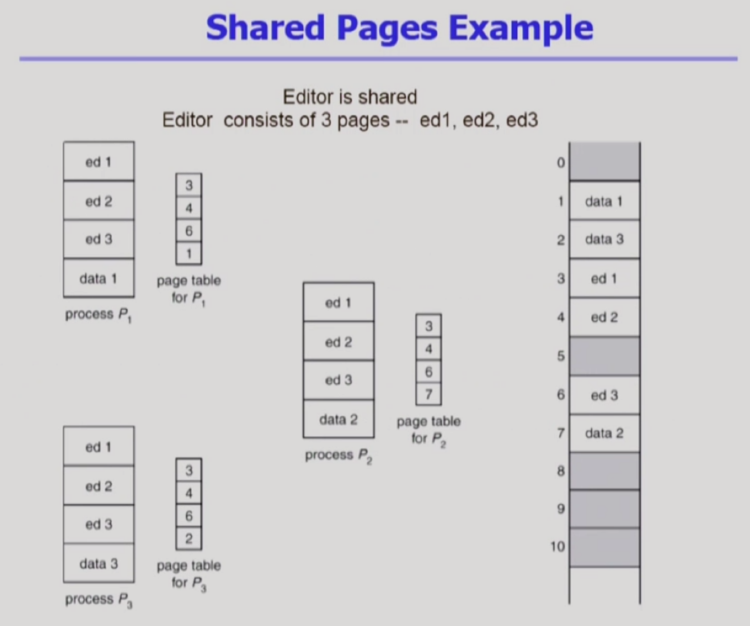

<!--more-->

### ①-6. Multilevel Paging
- Address Space가 더 커지면 다단계 페이지 테이블 필요
- 각 단계의 페이지 테이블이 메모리에 존재하므로 Logical Address의 Physical Address 변환에 더 많은 메모리 접근 필요
- TLB를 통해 메모리 접근 시간을 줄일 수 있음
- 4단계 페이지 테이블을 사용하는 경우
  - 메모리 접근 시간이 100ns, TLB 접근시간이 20ns이고 TLB hit ratio가 98%인 경우    
  Effective Memory Access Time = 0.98 x 120 + 0.02 x 520 => 128 nanoSecond => 결과적으로 주소변환을 위해 28ns만 소요    

=> TLB 덕분에 다단계 Page Table로 구성되어 있어도 빠르게 접근이 가능하다.   

      

=> Page Table에 주소변환 정보만 들어 있는 것이 아니라 엔트리마다 부가정보가 들어가 있음.    
(사용되지 않는 주소영역을 위해서도 엔트리가 만들어져야함     
ex. 위 그림에서 6번 7번에 해당    
테이블이라는 자료구조 특성상 위에서 부터 인덱스로 접근해야하므로..)   
 
### * Memory Protection을 위한 부가 정보
> Page Table의 각 Entry 마다 아래의 bit를 둔다. 

- **Protection bit**
  - Page에 대한 접근 권한(read / write / read-only)
  - 어떤 연산에 대한 접근 권한이 있는가를 나타냄.   
  ( 다른 프로세스가 이 페이지 접근하는 지에 대한 판단 x)
  - 코드영역 (read-only) : CPU에서 읽어서 Instruction을 실행하는 용도기 때문
  - 데이터 영역/스택 영역 (read/ wirte)
- **Valid-Invalid bit**
  - Valid는 해당 주소의 frame에 그 프로세스를 구성하는 유요한 내용이 있음을 뜻함 ( 접근 허용 )
  - Invalid는 해당 주소의 frame에 유효한 내용이 없음을 뜻함 (접근 불허 )
    - 프로세스가 그 주소 부분을 사용하지 않는 경우
    - 해당 페이지가 메모리에 올라와 있지 않고 Swap Area에 있는 경우

### ①-7. Inverted Page Table
- Page Table이 매우 큰 이유
  - 모든 Process 별로 그 Logical Address에 대응하는 모든 Page에 대해 Page Table Entry가 존재
  - 대응하는 Page가 메모리에 있든 아니든 간에 Page Table에는 Entry로 존재

- **Inverted Page Table**
  - Page Frame 하나당 Page Table에 하나의 Entry를 둔 것 (System-Wide)
  - 각 Page Table Entry는 각각의 물리적 메모리의 Page Frame이 담고 있는 내용 표시 (Process-id, Process의 Logical Address)
  - 단점 : 테이블 전체를 탐색해야함
  - 조치 : Associative Register 사용 (비쌈)

***Inverted Page Table은 시스템 내에 페이지 테이블이 딱 하나 존재한다.***   
페이지 테이블의 엔트리가 프로세스의 페이지 수 만큼 존재하는 것이 아니라
물리적 메모리의 페이지 프레임 개수만큼 존재하는 것.   
(첫 번째 엔트리는 첫 번째 페이지 프레임에 들어가는 논리적인 페이지 주소가 들어 있다)    
논리주소에 해당하는 p가 물리적 메모리 어디에 올라가 있는 보려면 엔트리를 다 찾아봐야한다.   

\* 사용하는 이유? 
PageTable을 위한 공간을 줄이기 위해!    
단, 시간적 오버헤드가 존재 한다.    
=> Associative register라는 HW를 통해 병렬적으로 검색할 수 있게 해줌    

페이지 테이블 구성    
(pid, p) => pid는 프로세스 아이디, p는 논리적 주소    
논리적 주소 p뿐만 아니라 어떤 프로세스의 p인지 알아야하므로 프로세스 아이디(pid)도 같이 저장해야한다.   

### ①-8. Shared Page
> Shared 가능한 코드는 물리적 메모리에 하나만 올리는 방식

- Re-entrant Code (=Pure code)
  1. read-only로 하여 프로세스 간에 하나의 code만 메모리에 올림
  2. Shared Code는 모든 프로세스의 Logical Address Space에서 동일한 위치에 있어야 함

- Private Code and Data
  - 각 프로세스들은 독자적으로 메모리에 올림
  - Private Data는 Logical Address Space의 아무 곳에 와도 무방

    
ex. 아래 한글을 프로세스 3개가 돌린다면 내용(data)은 다르지만 코드자체는 같다.