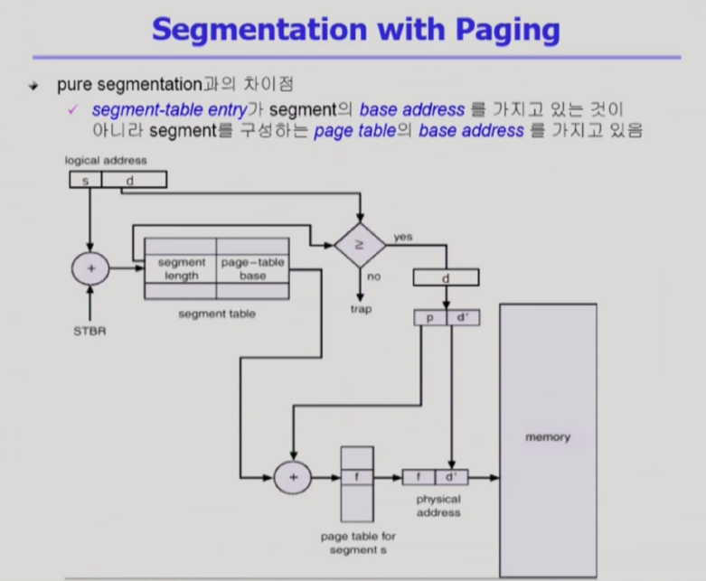

<!--more-->
  
## **② Segmentaion 기법**
> 프로그램을 구성하는 Address Space을 의미 단위로 쪼갠 것   
ex) Code, Data, Stack ( 더 작게 쪼갠다면 Code 중에서 함수별로..) 

- Logical Address는 <segment-number, offset>으로 구성
- **Segment Table Base Register(STBR) : Segment Table의 위치**
- **Segment Table Length Register(STLR) : 프로그램이 사용하는 Segment 수**

### **Segmentation 기법에 의한 주소 변환**
    

CPU가 논리 주소를 주게 되면 두 부분으로 나눈다.   
( s,d ) = ( 세그먼트 번호,  offset )     

Paging 기법과는 다르게 **엔트리에 2가지 정보를 가지고 있다.(= SegmentTable)**   
=> ( 세그 먼트의 길이, 물리적 메모리의 시작 위치 )    
페이징 기법에서는 페이지 크기가 다 동일했지만   
***세그먼테이션 기법에서는 의미 단위로 자르기 때문에 세그먼트의 길이가 균일하지 않기 때문에 길이 정보 필요.***    

**세그먼트 테이블의 시작위치 = STBR**   
**세그먼트 길이 = STLR**    

잘못된 세그먼트 번호가 들어왔을때 STLR와 비교한다.     
( 5번 요청했는데 구성은 3개가 최대라면 체크 )

### Segmentation Architecture
- Protection
  - 각 세그먼트 별로 Protection bit가 있음.
  - Each Entry
    - Valid bit = 0 => illegal segemnt
    - Read / Write / Executrion 권한 bit
- Sharing
  - Shared Segment
  - Same Segemnt Number
- Allocation
  - First Fit / Best Fit
  - 외부 단편화 발생

장점 : 세그먼트는 의미 단위이기 때문에 공유와 보안에 있어 Paging보다 훨씬 효과적이다.   
단점 : 할당에 있어서 외부 단편화    

cf) 테이블을 위한 메모리 낭비가 심한 것은 세그먼테이션 기법보다는 페이징 기법이 심함.

## **③ Segmentaion 기법**
> Paging 기법과 Segmetation 기법을 혼합.    
세그먼트를 여러개의 페이지로 구성하는 기법

  

### 주소변환 과정
- 논리 주소 => ( s, d ) = (세그먼트 주소, 세그먼트 offset)
- 세그먼트 테이블 => s번째 엔트리를 가면 세그먼트에 대한 주소 변환 정보가 있음.   

기존 세그멘테이션 기법은 세그먼트가 통째로 메모리에 올라가기 때문에 시작 위치만 알려줬지만 현재는 세그먼트가 페이지 단위로 쪼개져서 메모리에 올라간다.     
=> Allocation 문제 해결 (Hole문제)     
=> 의미나 보안 같은 경우는 세그먼트 테이블 레벨에서 시행함    
=> 2가지 장점을 획득!   

- 세그먼트당 페이지 테이블이 존재 => 페이지 테이블의 시작위치   
offset d를 잘라서 (p, d) = ( 페이지번호, 페이지 offset )을 사용   
- 페이지 테이블 시작위치 + 페이지 번호 떨어진 엔트리 => 프레임 번호   
- 프레임번호, 오프셋 => 물리적 메모리 주소    