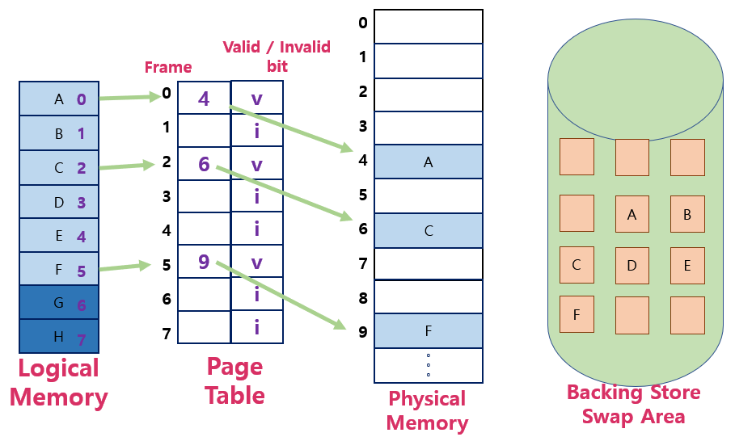
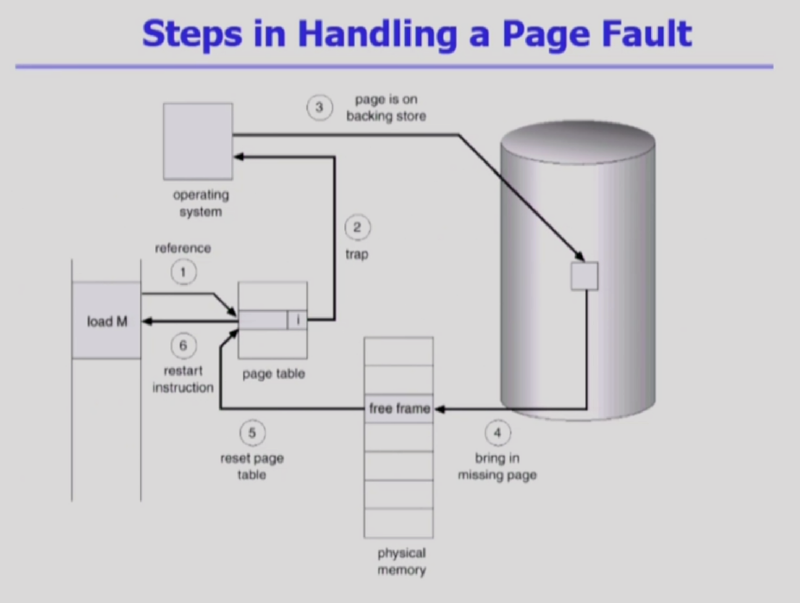
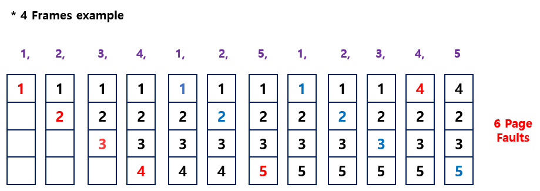
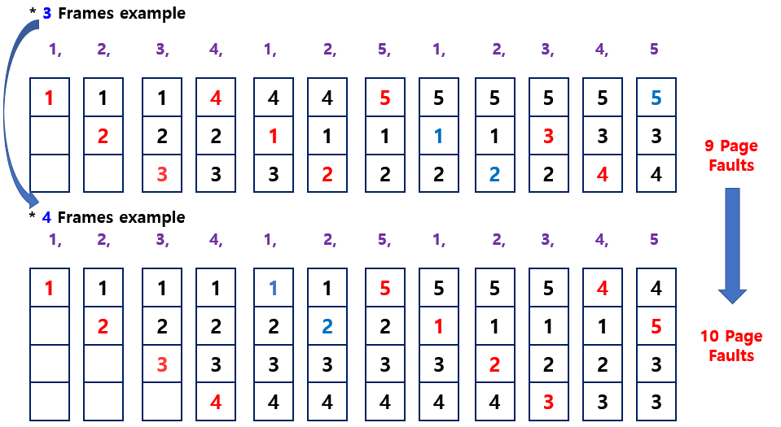
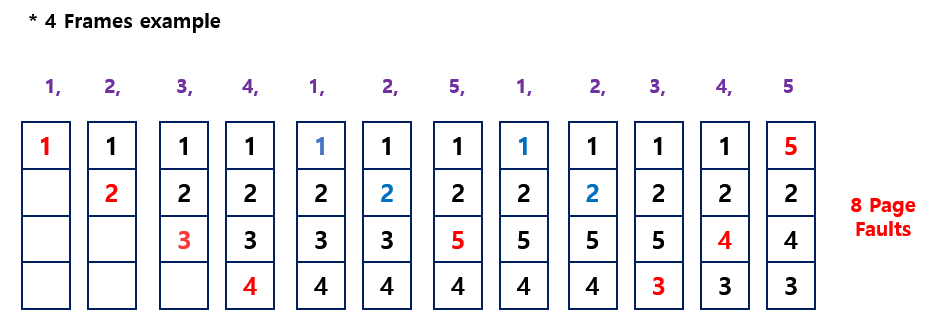
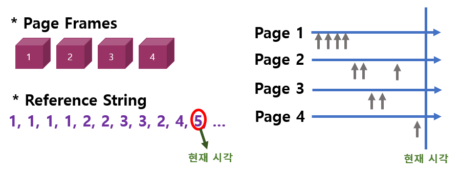
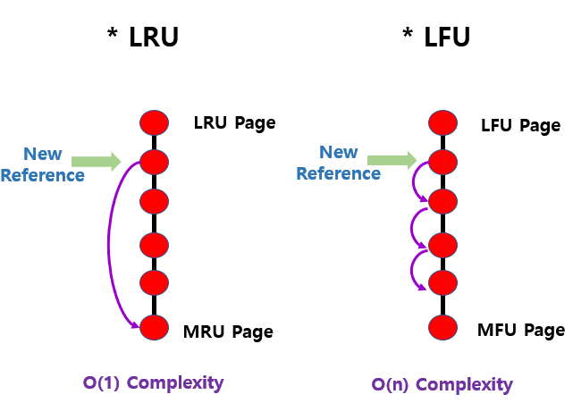

<!--more-->

# 1. Demand Paging
> 요청이 있으면 Page를 메모리에 올리겠다.

- 장점
  - I/O 양의 감소
  - Memory 사용량 감소
  - 빠른 응답 시간
  - 더 많은 사용자 수용
- Valid / Invalid Bit의 사용
  - Invalid의 의미
    - 사용되지 않는 주소 영역인 경우
    - 페이지가 물리적 메모리에 없는 경우
  - 처음에는 모든 Page Entry가 Invalid로 초기화
  - Address Traslation 시에 Invalid Bit이 Set되어 있으면 => **Page Fault**

     

# 2. Page Fault
> 주소변환을 하려고 했으나 Invaild일 경우 Page Fault를 발생    
요청하는 Page가 메모리에 없을 때 => CPU는 자동적으로 운영체제에 넘어가고(Trap : 소프트웨어 인터럽트) Fault 일어난 Page를 메모리에 올린다.   

- Invalid Page를 접근하면 MMU가 Trap을 발생시킴 (Page Fault Trap)
- Kernel Mode로 들어가서 Page Fault Handler가 invoke됨
- Page Fault 처리 순서
	1. 잘못된 요청인지 판별
	2. 정상 요청일 경우 메모리에 올려야하는데 메모리가 꽉 차있다면 하나를 내린다.
	3. 해당 Page를 Disk에서 Memory로 읽어온다.    
  ( I/O 작업이므로 느림. 따라서 CPU를 I/O 작업 끝날때 까지 넘긴다.)
	4. Disk Read 끝나면 Vaild로 바꾼다.
	5. CPU 다시 넘겨 받고 다시 명령어들 수행한다.

    

# 3. Page Replacement
- 어떤 frame을 빼앗아올지 결정해야함.
- 곧바로 사용되지 않읗 Page를 쫓아낸느 것이 좋음.
- 동일한 페이지가 여러 번 메모리에서 쫓겨났다가 다시 들어올 수 있음.
- Replacement Algorithm
  - Page-Fault Rate을 최소화하는 것이 목표
  - 주어진 Page Reference String에 대해 Page Fault를 얼마내 내는지로 알고리즘을 평가

## 1) Optimal Algorithm
> 가장 먼 미래에 참조되는 Page를 Replace

    

- 미래의 참조를 어떻게 아는가?
  - Offline Algorithm
- 다른 알고리즘의 성능에 대한 Upper Bound 제공
  - Belady's Optimal Algorithm, MIN, OPT 등으로 불림

=> 가장 좋은 알고리즘으로 PageFault를 가장 적게 하는 알고리즘이다.    
하지만 실제 시스템에서는 미래에 언제 참조할지를 모르기 때문에 실제 시스템에서는 사용되지 않음.    

## 2) FIFO( First-In First-Out ) Algorithm
> 먼저 들어온 것을 먼저 내쫓음.   

    

특징 : Page Frame 메모리 크기를 늘려주면 오히려 Page Fault가 늘어나는 현상이 발생 ( = FIFO Anomaly )    

## 3) LRU (Least Recently Used) Algorithm
> 가장 덜 최근에 사용된 Page를 내린다.    
( 가장 오래전에 사용된 것을 쫓아냄 )    

    
=> 최근에 사용된 Page가 미래에도 다시 참조될 가능성이 높다는 것을 아이디어로 사용.    

## 4) LFU (Least Frequently Used) Algorithm
> 가장 덜 비번하게 사용된 Page를 쫓아냄   
(참조 횟수가 제일 적은 page를 쫓아낸다)   

- 최저 참조 횟수 Page가 여럿 있는 경우
  - LFU 알고리즘 자체에서는 여러 Page 중 임의로 선정한다.
  - 성능 향상을 위해 가장 오래 전에 참조된 Page를 지우게 구현할 수도 있다.
- 장/단점
  - LRU 처럼 직전 참조 시점만 보는 것이 아니라 장기적으로 시간 규모를 보기 때문에 Page의 인기도를 좀 더 정확히 반영할 수 있음
  - 참조 시점의 최근성을 반영하지 못함
  - LRU보다 구현이 복잡함

### * LRU VS LFU
    

\* 현재시각 5번 Page를 보관하기 위해 어떤 Page를 삭제하는가?
- LRU : 1번 Page 삭제
- LFU : 4번 Page 삭제

LRU 단점 : 마지막 참조시점만 보기 때문에 그 이전의 기록을 생각하지 않는다.    
(가장 오래전에 참조되긴 했지만 참조 비율이 높을 수 있다.)   

LFU 단점 : 참조횟수가 적지만 이제 막 여러번의 참조가 시작되는 Page를 쫓아낼 수 있다.    

    

### * LRU
**참조 시간 순서로 한 줄로 줄세우기**   
맨 위 - 가장 오래전에 참조된 것   
맨 아래 - 가장 최근에 참조된 페이지   

-> 새로운 페이지 올라가면 맨 아래로 보내면 됨( 가장 최근이기 때문 )
쫓아내는 것은 맨 위에 것을 쫓아내면 됨   
=> 따라서 시간 복잡도 O(1) : 쫓아내기 위해서 비교가 필요 없기 때문    

### * LFU
**참조 횟수로 한 줄로 줄세우기**   
맨 위 - 참조횟수가 가장 적은 것   
맨 아래 - 참조횟수가 가장 많은 것   

-> 새로운 페이지 올라가면 하나하나 다 비교해야한다.   
=> 따라서 시간 복잡도 O(n) : n번 비교해야기 때문 비효율적이다..   
=> 힙을 이용해서 구현하는 것이 더 효율적이다. => O(log n)   

