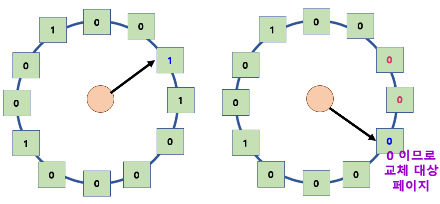
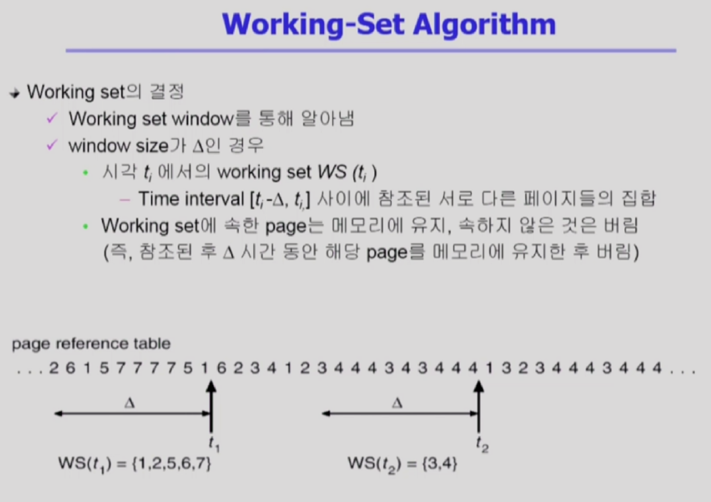
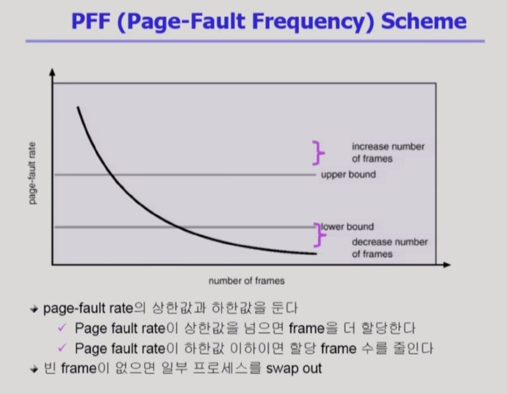

<!--more-->
  
# 1. 다양한 캐싱환경
- 캐싱 기법
  - **한정된 빠른 공간(=캐쉬)에 요청된 데이터를 저장해 두었다가 후속 요청시 캐쉬로부터 직접 서비스하는 방식**
  - Paging System 외에도 Cache Memory, Buffer Caching, Web Caching 등 다양한 분야에서 사용
- 캐쉬 운영의 시간 제약
  - 교체 알고리즘에서 삭제할 항목을 결정하는 일에 지나치게 많은 시간이 걸리는 경우 실제 시스템에서 사용할 수 없음
  - Buffer Caching이나 Web Caching의 경우
    - O(1)에서 O(log n) 정도까지 허용
  - Paging System인 경우
    - Page Fault인 경우에만 OS가 관여함
    - 페이지가 이미 메모리에 존재하는 경우 참조시각 등의 정보를 OS가 알 수 없음
    - O(1)인 LRU의 List 조작조차 불가능
  
cf)   
**Cache Memory : CPU와 Main Memory 사이에 존재하는 메모리**   
Buffer Caching : 파일 시스템에 대한 read/write 요청을 메모리에서 빠르게 서비스하는 방식   
=> 매체는 동일하고 빠른 것은 물리적 메모리     
Web Caching : 웹페이지에 대한 요청 => 멀리에 있는 웹서버에서 가져와서 브라우져에 뿌려줌   
동일한 URL에 요청하는것을 웹서버에서 불러오는 것은 시간이 오래걸리므로 저장해서 씀    

# 2. Paging System에서 제약사항
> Paging System에서 LRU, LFU 가능한가?    

\* 주소변환 증 요청한 페이지가 존재한 경우(=Vaild)    
그대로 주소변환하면 되므로 CPU 권한을 그대로 프로세스가 갖고 있고
하드웨어적으로 주소변환해서 CPU로 읽어 들인다.    

\* 주소변환 중 요청한 페이지가 존재하지 않는 경우 (=Invaild => Page Fault)    
디스크 I/O 작업이 필요하게 되고 프로세스가 읽어올 수 없으므로 Trap이 발생한다.    
이는 CPU 권한이 프로세스에서 운영체제로 넘어가게 되고 운영체제가 I/O 작업을 해준다.     
( 필요한 경우 Replacement 실행  
=> 운영체제가 가장 최근에 참조되었는지(LRU), 참조 빈도가 높은지(LFU) 알 수 없다.    
Valid일때는 하드웨어적으로 이미 처리되어서 운영체제에 참조 시간이나 빈도에 대한 정보를 주지 않기 때문에... )    

그렇다면 Paging System에서는 어떤 알고리즘을 사용해야하는가?    

# 3. Clock Algorithm
- LRU의 근사 알고리즘
- 여러 명칭으로 불림
  - Second Chance Algorithm
  - NUR (Not Used Recently) or NRU (Not Recetly Used)
- Reference Bit을 사용해서 교체 대상 페이지 선정
- Reference Bit가 0인 것을 찾을 때까지 포인터를 하나씩 앞으로 이동
- 포인터 이동하는 중 Reference Bit 1은 모두 0으로 바꿈
- Reference Bit이 0인 것을 찾으면 그페이지를 교체
- 한 바퀴 돌아와서도(=Second Chance) 0이면 그때에는 Replace 당함
- 자주 사용되는 페이지라면 Second Chance가 올때 1
- 개선사항?
  - Reference Bit와 Modified Bit(Dirty Bit)을 함께 사용
  - Reference Bit = 1 : 최근에 참조된 페이지
  - Modified Bit = 1 : 최근에 변경된 페이지 (I/O를 동반하는 페이지)

\* **Reference Bit**    
=> 하드웨어가 어떤 페이지가 참조가 되었다면 Reference Bit을 1로 셋팅    
페이지가 참조되었다고 표시함.

\* **Modified Bit**    
=> 최근 변경된 페이지로 메모리에서 쫓겨날때 Modified Bit가 1인경우는 
Backing Store(=Disk)에 해당 내용을 반영한 후 쫓아내야한다.    

  

설명)   
사각형 : Page Frame   
Reference Bit : 1인 페이지는 최근 참조되었다는 것을 의미한다.   

H/W가 참조된 것을 Reference Bit 1로 바꾸는 역할을 하고    
운영체제는 Reference Bit를 확인하면서 어떤 것을 쫓아낼 지 결정한다.   
Circulus Linked List를 돌면서   
Reference Bit이 1인 것은 0으로 바꾸고 다음 페이지를 확인한다.   
Reference Bit이 0이면 쫓아낸다.   
=> 어느정도 LRU와 비슷한 효과를 낼 수 있다.

# 4. Page Frame의 Allocation
- 할당 문제 : 각 Process에 얼마만큼의 Page Frame을 할당할 것인가?
- Allocation의 필요성
  - 메모리 참조 명령어 수행시 명령어, 데이터 등 여러 페이지 동시 참조   
  => 명령어 수행을 위해 최소한 할당되어야 하는 Frame의 수가 있음
  - Loop를 구성하는 Page들은 한꺼번에 Allocate 되는 것이 유리함   
  => 최소한의 Allocation이 없으면 Loop마다 Page Fault
- Allocation Scheme
  - **Equal Allocation** : 모든 프로세스에 똑같은 갯수 할당
  - **Proportional Allocation** : 프로세스 크기에 비례하여 할당
  - **Priority Allocation** : 프로세스의 Priority에 따라 다르게 할당

## Global vs Local Replacement
- **Global Replacement**    
: 굳이 미리 할당하지 않고 Working Set이나 PFF 같은 알고리즘을 사용하면 
그때그때 프로그램별로 알아서 할당되는 효과가 나온다.
  - Replace 시 다른 Process에 할당된 Frame을 빼앗아 올 수 있다.
  - Process별 할당량을 조절하는 또 다른 방법
  - FIFO, LRU, LFU 등의 알고리즘을 Global Replacement로 사용시에 해당
  - Working Set, PFF 알고리즘 사용
- **Local Replacement**   
: 프로그램들한테 미리 메모리 할당을 한다면 프로그램은 자신에게 할당된 메모리내에서 쫓아내고 올리고를 할 수 있다. (위와 달리 다른 프로그램 영역 x)
  - 자신에게 할당된 Frame 내에서만 Replacement
  - FIFO, LRU, LFU 등의 알고리즘을 Process 별로 운영시

# 5. Trashing
> 프로그램에 메모리가 너무 적게 할당이 되어 Page Fault가 지나치게 일어나는 현상

- **프로세스의 원활한 수행에 필요한 최소한의 Page Frame 수를 할당 받지 못한 경우 발생**
- Page Fault Rate이 매우 높아짐
- CPU Utilization이 낮아짐
- OS는 MPD(Multiprogramming degree)를 높여야 한다고 판단
- 또 다른 프로세스가 시스템에 추가됨 (higher MPD)
- 프로세스 당 할당된 Frame의 수가 더욱 감소
- 프로세스는 Page의 Swap In / Swap Out으로 매우 바쁨
- 대부분의 CPU는 한가함 => Low Throughput

\* Degree of multiprogramming : 메모리에 동시에 올라가 있는 프로그램에 따라서 CPU utilization : CPU 이용률은 어떠한가?    
Degree of multiprogramming을 적당히 하면 좋은 효율을 내지만   
너무 높게 되면 PageFault 빈번하게 일어나서 CPU utilization이 줄어든다.    
=> 따라서 동시에 메모리에 올라가는 프로세스의 개수를 조절해줘야한다.    

이를 가능하게 해주는 알고리즘??

## 1) Working-Set
- **Locality of reference (참조 지역성)**
  - **프로세스는 특정 시간 동안 일정 장소만을 집중적을 참조한다.**
  - 집중저으로 참조되는 해당 Page들의 집합을 Locality Set이라 함.

- **Working-Set Model**
  - ***Locality에 기반하여 프로세스가 일정 시간 동안 원활하게 수행되기 위해 한꺼번에 메모리에 올라와 있어야하는 Page들의 집합을 Working Set이라 정의***
  - Working Set 모델에서는 Process의 Working Set 전체가 메모리에 올라와 있어야 수행되고 그렇지 않을 경우 모든 Frame을 반납한 후 Swap Out(Suspend)
  - Thrashing을 방지함
  - Mulitprogramming Degree를 결정함

 

## 2) PFF(Page-Fault Frequency)
> 직접 Page Fault 비율을 본다.

- Page Size를 감소 시킨다면?
  - 페이지 수 증가
  - 페이지 테이블 크기 증가
  - 내부 단편화 감소
  - Disk Transfer의 효율성 감소
  - 필요한 정보만 메모리에 올라와 메모리 이용 효율적
    - Locality의 활용 측면에서는 좋지 않음.
