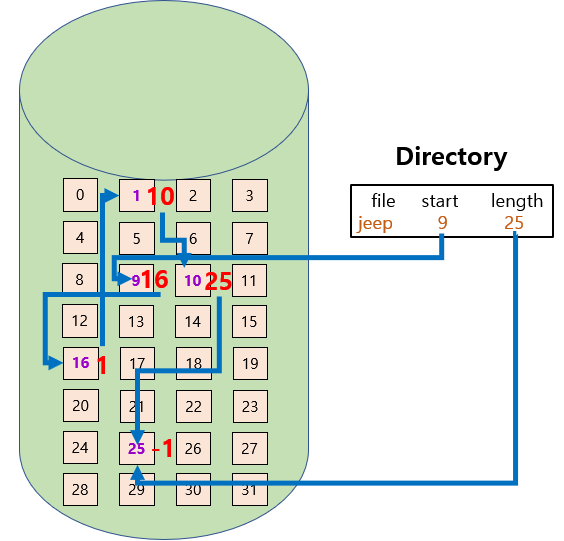
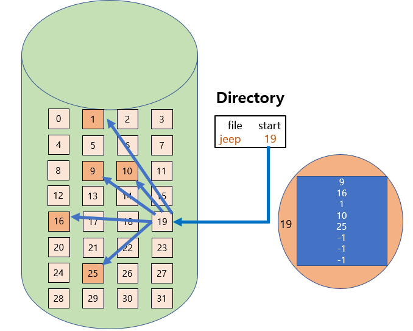
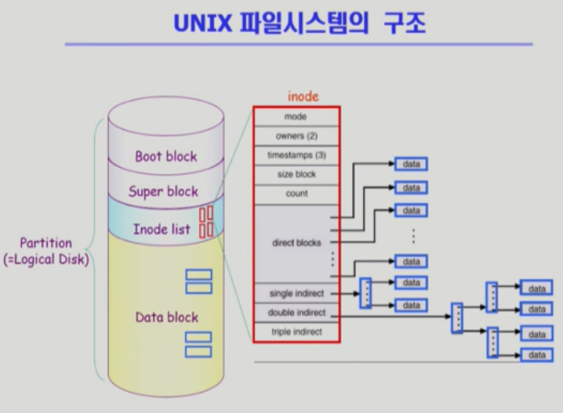
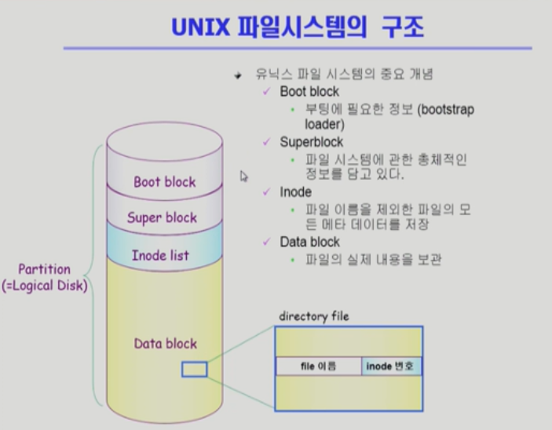
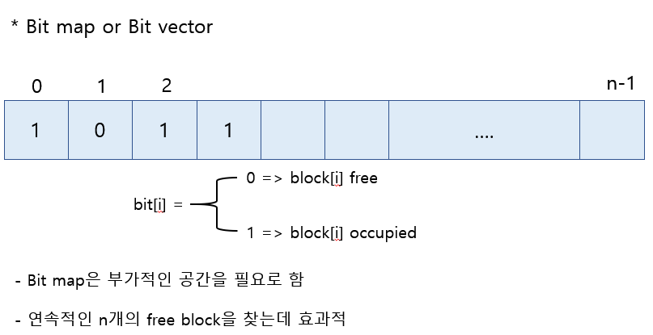

<!--more-->

# 1. 디스크에 파일을 저장하는 방식
1. Contiguous Allcocation
2. Linked Allocation
3. Indexed Allocation

cf) 파일은 크기가 균일하지 않다.    
디스크에다가 파일을 저장할 때는 **동일한 크기의 Sector 단위로 나누어서 저장**하고 있다.   
동일한 저장단위를 **논리적인 블록**이라고 본다.   
임의의 크기의 파일을 동일 크기의 블록단위로 나누어서 저장하고 있다.   

## 1) 연속 할당 (Contiguous Allcocation)
> 하나의 파일이 디스크 상에 연속해서 저장되는 방식

    
\* 장/단점    
- 장점 : 
① 빠른 I/O가 가능하다.    
( 디스크 접근 시간은 대부분은 Head가 이동하는 시간이기 때문인데   
연속 할당 되어 있다면 한 번 Seek로 많은 양의 데이터를 읽고 쓸 수 있다.)   
② Swapping과 같이 속도가 중요할 때 효과적이다.    
③ 직접 접근이 가능하다.   
- 단점 : 
① 외부 단편화 ( 중간중간 Hole이 생긴다)    
② 파일의 크기를 키우는데 제약이 존재    
=> 미리 할당해두는 방식은? 내부 단편화이 생김.   

## 2) 링크연결 할당 (Linked Allocation)
> 하나의 파일이 디스크 상에 빈 곳 아무데나 저장되는 방식

  

\* 장/단점
- 장점 :    
① 외부 단편화 문제 발생하지 않는다.
- 단점 :    
① 직접 접근이 안된다.   
( ex. 중간 위치를 보기 위해서는 앞에서 부터 순차 접근해야함)    
② 디스크의 섹터들이 간혹 Dead Sector가 되는데 이러면 뒷 부분을 접근할 수 없게 된다.   
③ 한 섹터당 512 바이트 배수로 저장하는데 4 바이트를 포인터를 사용해서 두 섹터를 사용할 수도 있게되므로 공간 낭비를 할 수 있다.    

=> 약간 변형해서 효율적으로 바꾼다.   
**File-Allocation Table (FAT)**   

## 3) 인덱스 할당 (Indexed Allocation)
> 인덱스 블록에 디스크 상에 어디어디 저장되어있는지 표시하는 방식

    

\* 장/단점
- 장점 :
① 외부 단편화 발생하지 않는다.   
② 직접 접근이 가능하다.   
- 단점 :
① 아무리 작은 사이즈라고 하더라도 인덱스를 위한 블록과 실제 데이터를 저장하기 위한 블록이 필요하다.    
② 큰 사이즈의 파일인 경우 하나의 인덱스 블록으로는 표시가 불가능하다.   

# 2. 유닉스 파일 시스템 구조
    
    

- **Boot block** : 부팅에 대한 정보
- **Super block** : 어디가 빈 블록이고 실제로 사용중인 블록인지 총체적으로 관리
- **Inode list**(파일 하나당 Inode 하나) : File meta data는 그 파일을 가지고 있는 디렉토리에 가면 기록되어있다고 했는데 실제 파일시스템에서는 디렉토리가 다 가지고 있지 않고 별도의 위치에 저장    
(디렉토리에 파일 이름과 Inode번호가 저장)   

# 3. FAT File System
    
- **FAT** : 파일의 메타 데이터 일부를 이 곳에 보관    
(위치정보만! 나머지는 디렉토리가 가지고 있다)   
FAT 배열의 크기는 디스크가 관리하는 데이터 블록의 개수만큼 이며, 그 블록의 다음 블록이 어디인지를 담고 있다.    
***FAT은 Linked Allocation의 단점을 모두 극복한다.***

# 4. Free-Space Management
> 비어 있는 블록을 어떻게 관리할 것인가?

    

- **Bit map or bit vector** : 블록번호를 이용하여 사용중인지 비어있는지 비트로 표시 
- **Linked list** : 비어있는 블록들을 연결해둔다.
  - 모든 free block들을 링크로 연결(free list)
  - 연속적인 가용공간을 찾는 것은 쉽지 안핟.
  - 공간의 낭비가 없다.
- **Grouping** : 첫 번째 비어있는 위치가 인덱스 역할->비어있는 곳들을 가르킴
  - Linked list방법의 변형
  - 첫 번째 free block이 n개의 pointer를 가짐
    - n-1 pointer는 free data block을 가리킴
    - 마지막 pointer가 가리키는 block은 또 다시 n pointer를 가짐
- **Counting** : 빈 블록의 위치를 가르키고 거기에 몇 개가 빈 블록이라는 것을 쌍으로 갖는다.  
  - 프로그램들이 종종 여러개의 연속적인 block을 할당하고 반납한다는 성질에서 착안
( Linked, Grouping은 연속적인 부분을 찾기 어렵지만 Counting은 가능)  

# 5. Directory Implementation
> 디렉토리는 그 디렉토리 밑에 있는 파일의 메타데이터를 관리하는 특별한 파일.    
디렉토리 내용을 어떻게 저장할 것인가, 디렉토리를 어떻게 구현할 것인가?

- **Linear List**
  - <file name, file의 meta data> 의 list
  - 구현이 간단
  - 디렉토리 내에 파일이 있는지 찾기 위해서는 Linear Serach 필요
- **Hash Table**
  - Linear List + Hashing
  - Hash Table은 File Name을 이 파일의 Linear List의 위치로 바꾸어줌
  - Search Time을 없앰
  - Collision 발생 가능

\* File의 meta data의 보관 위치
  - 디렉토리 내에 직접 보관
  - 디렉토리에는 포인터를 두고 다른 곳에 보관
    - inode, FAT 등

\* Long File Name의 지원
  - <file name, file의 meta data>의 list에서 각 entry는 일반적으로 고정 크기
  - file name이 고정 크기의 entry 길이보다 길어지는 경우 entry의 마지막 부분에 이름의 뒷부분이 위치한 곳의 포인터를 두는 방법
  - 이름의 나머지 부분은 동일한 directory file의 일부에 존재

# 6. VFS and NFS
- **Virtual File System (VFS)**
  - 서로 다른 다양한 File System에 대해 동일한 시스템 콜 인터페이스(API)를 통해 접근할 수 있게 해주는 OS의 layer

- **Network File System (NFS)**
  - 분산 시스템에서는 네트워크를 통해 파일이 공유될 수 있음
  - NFS는 분산 환경에서의 대표적인 파일 공유 방법임

   

# 7. Page Cache와 Buffer Cache

## 1) Page Cache
- Virtual Memory의 Paging System에서 사용하는 Page Frame을 Caching의 관점에서 설명하는 용어
- Memory-Mapped I/O를 쓰는 경우 File의 I/O에서도 Page Cache 사용    

\* **Memory-Mapped I/O**
- File의 일부를 Virtual Memory에 Mapping 시킴
- 매핑시킨 영역에 대한 메모리 접근 연산은 파일의 입출력을 수행하게 함
- 파일을 접근할 때 read/write 콜을 하지 않고 파일의 일정부분을 메모리 영역에 맵핑해서 사용

## 2) Buffer Cache
- 파일 시스템을 통한 I/O 연산은 메모리의 특정 영역인 Buffer Cache 사용
- File 사용의 Locality 활용
  - 한번 읽어온 block에 대한 후속 요청시 Buffer Cache에서 즉시 전달
- 모든 프로세스가 공용으로 사용
- Replacement Alogorithm 필요 (LRU, LFU 등)

## 3) Unifined Buffer Cache
- 최근의 OS에서는 기존의 Buffer Cache와 Page Cache에 통합됨

# 8. Page Cache와 Buffer Cache에 관리하는 방법
> Page Cache와 Buffer Cache에 관리하는 방법이 다르다.

가상 메모리에서의 **Page Cache**는 운영체제에게 전해지는 정보가 지극히 적었음.    
이미 메모리가 존재하는 데이터 대해서는 HW에서 주소변환만 해서 정확한 접근 시간같은 정보를 알 수 없어서 **Clock 알고리즘을 사용**했다.   

파일 시스템에서의 **Buffer Cache**는 메모리에 올라가 있던 아니던 간에
어차피 파일을 접근할 때는 시스템 콜을 해야하기 때문에 CPU 제어권이 운영체제에게 넘어가기 때문에 모든 정보를 알 수 있어서 **LRU, LFU를 사용**할 수 있다.