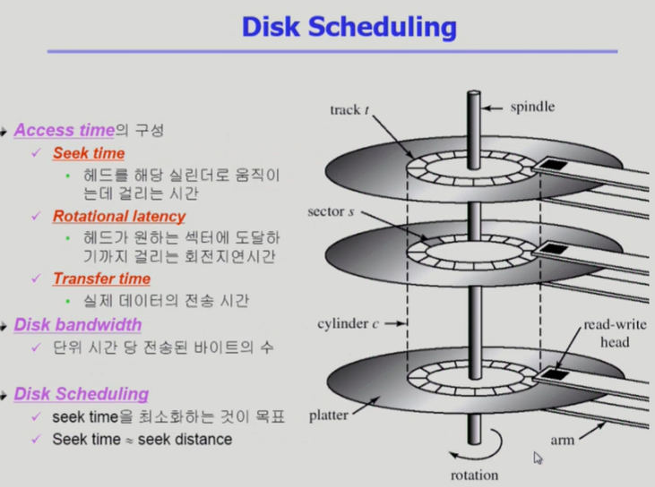

<!--more-->
  
# 1. Disk Structure
- **Logical Block**
  - 디스크의 외부에서 보는 디스크의 단위 정보 저장 공간들
  - 주소를 가진 1차원 배열처럼 취급
  - 정보를 전송하는 최소 단위
- **Sector**
  - Logical Block이 물리적 디스크에 매핑된 위치
  - 디스크를 관리하는 최소의 단위
  - Sector 0은 최외곽 실린더의 첫 트랙에 있는 첫 번째 섹터이다.

# 2. Disk Management
- **Physical Formatting**
  - 디스크를 컨트롤러가 읽고 쓸 수 있도록 **sector들로 나누는 과정**
  - 각 섹터는 header + 실제 data(보통 512byte) + trailer로 구성
  - header와 trailer는 sector number, ECC(Error-Correcting Code) 등의 정보가 저장되며 controller가 직접 접근 및 운영    
  (ECC : 내용을 요약하여 해쉬 함수를 적용한 데이터 - 축약본으로 오류 검출용)
- **Partitioninig**
  - 디스크를 하나 이상의 실린더 그룹으로 나누는 과정
  - OS는 이것을 **독립적 Disk로 취급**(Logical Disk)
- **Logical Formatting**
  - **파일 시스템을 만드는 것**
  - FAT, Inode, Free Space 등의 구조 포함
- **Booting**
  - ROM에 있는 "small bootstrap loader"의 실행
  - sector 0 (boot block)을 load하여 실행
  - sector 0 "full bootstrap loader program"
  - OS를 디스크에서 load하여 실행
  - **하드디스크에서 0번 sector를 읽고 실행 => 운영체제 커널 위치를 찾아서 올림**

# 4. 디스크 접근 시간
    

cf) Seek Time이 가장 많은 시간을 소요

# 5. Disk Scheduling Alogrithm
- **FCFS**
- **SSTF**
- **SCAN**
- **C-SCAN**
- **N-SCAN**
- **LOOK**
- **C-LOOK**    

ex. 큐에 다음과 같은 실린더 위치의 요청이 존재하는 경우,
디스크 헤드 53번에서 시작한 각 알고리즘의 수행 결과는?    
(실린더 위치는 0-199)   

98, 183, 37, 122, 14, 124, 65, 67   

## 1) FCFS (First Come First Service)
> 들어온 순서대로 처리한다.

    

## 2) SSTF (Shortest Seek Time First)
> 현재 헤드 위치에서 제일 가까운 요청을 처리한다.   
=> 디스크 이동 시간이 적지만 Starvation이 일어날 가능성이 높다.

    

## 3) SCAN
> 상황에 좌우받지 않고 한 방향으로 끝까지 가면서 처리하고 끝까지 가면 방향을 바꿔서 반복    
=> 가장 간단하면서도 획기적인 방법으로 엘레베이터와 비슷하다.

- Disk arm이 디스크의 한쪽 끝에서 다른쪽 끝으로 이동하며 가는 길목에 있는 모든 요청을 처리한다.
- 다른 한쪽 끝에 도달하면 역방향으로 이동하며 오는 길목에 있는 모든 요청을 처리하며 다시 반대쪽 끝으로 이동한다.
- 문제점 : 실린더 위치에 따라 대기 시간이 다르다.   

  

## 4) C-SCAN (Circular Scan)
> 디스크 헤드가 한 쪽 방향만 처리 (되돌아갈때는 처리하지 x)   
=> 이동거리는 늘어날 수 있으나 SCAN 보다는 대기 시간이 균일해진다.

- 헤드가 한쪽 끝에서 다른 쪽 끝으로 이동하며 가는 길목에 있는 모든 요청을 처리
- 다른쪽 끝에 도달했으면 요청을 처리하지않고 곧바로 출발점으로 다시 이동
- SCAN보다 균일한 대기 시간을 제공    

  

  

## 5) N-SCAN
- SCAN의 변형 알고리즘
- 일단 arm이 한 방향으로 움직이기 시작하면 그 시점 이후에 도착한 job은 되돌아올 때 Service
- 출발하기 전에 들어온 것들은 가면서 처리 하지만 가는 도중 들어오는 애들은 처리X

## 6) LOOK and C-LOOK
- SCAN이나 C-SCAN은 헤드가 디스크 끝에서 끝으로 이동
- LOOK과 C-LOOK은 헤드가 진행 중이다가 그 방향에 더이상 기다리는 요청이 없으면 헤드의 이동방향을 즉시 반대로 이동한다.

  

# 6. Disk-Scheduling Algorithm 결정
> 현대 디스크 시스템에서는 SCAN 기반한 알고리즘을 주로 쓰고 있다.

- SCAN, S-SCAN 및 그 응용 알고리즘은 LOOK, C-LOOK등이 일반적으로 디스크 입출력이 많은 시스템에서 효율적인 것으로 알려져 있음.

- File의 할당 방법에 따라 디스크 요청이 영향을 받음

- 디스크 스케줄링 알고리즘은 필요할 경우 다른 알고리즘으로 쉽게 교체할 수 있도록 OS와 별도의 모듈로 작성되는 것이 바람직하다.

# 7. Swap-Space Management
- **Disk**를 사용하는 두 가지 이유
  1. Memory의 Volatile한 특성 => **File System**
  2. 프로그램 실행을 위한 Memory 공간 부족 => **Swap Space**
- **Swap Space**
  - Virtual Memory System에서는 디스크를 Memory의 연장 공간으로 사용
  - 파일 시스템 내부에 둘 수 있으나 별도 Partition 사용이 일반적
    - 공간효율성보다는 속도 효율성이 우선
    - 일반 파일보다는 훨씬 짧은 시간만 존재하고 자주 참조됨
    - block의 크기 및 저장 방식이 일반 파일 시스템과 다름

  

\* 하드디스크에서 Swap Space를 어떻게 관리해야하는가?   
물리적 디스크를 Partitioning 해서 Logical Disk를 만들 수 있고,     
운영체제는 각각의 Logical Disk를 각각을 독립적인 디스크로 간주하게 된다.  

\* Logical Disk는 File System으로 사용될 수 있고 Swap Area로도 사용될 수 있다.    
- **File System**은 512Byte의 Sector 단위로 데이터를 저장하고 있고 데이터를 저장하는 방식은 연속할당, 링크 할당, 인덱스 할당 등이 존재했다.
- **Swap Area**는 프로그램이 실행되는 동안에 Swap Area에 머물러 있던 프로세스의 주소공간이 프로그램이 끝나면 사라지게 된다.   
=> 그렇기 때문에 공간활용성보다는 시간활용성이 중요하다.    
(빨리 올리고 내리고가 중요 => Seek Time을 줄여야한다.)    

# 8. RAID
> Redundant Array of Independent Disks    
여러 개의 디스크를 묶어서 사용

- 사용 목적
  - 디스크 처리 속도 향상
    - 여러 디스크 block의 내용을 분산 저장
    - 병렬적으로 읽어옴 (Interleaving, Sriping)
  - 신뢰성 향상
    - 동일 정보를 여러 디스크에 중복 저장
    - 하나의 디스크가 고장시 다른 디스크에서 읽어옴 (Mirroring, Shadowing)
    - 단순한 중복 저장이 아니라 일부 디스크에 Parity를 저장하여 공간의 효율성을 높일 수 있다.

=> 중복 저장, 분산 저장등을 활용    

cf)   
여러 곳에서 조금씩 조금씩 읽어올 수 있어서 디스크 처리 속도 향상    
=> 분산 처리 후 병렬적으로 읽어온다.     
- Interleaving : 여기 저기서 조금씩 읽어옴
- Striping : 디스크를 조금씩 나눠서 저장
